+++
title = "Implementing a Pixar paper"
description = "My experience understanding and implementing a Pixar paper."
date = 2026-02-08
[taxonomies]
tags = ["maya", "programming", "autorig"]
+++


A few weeks ago, I stumbled upon a paper by Pixar's research team entitled [Sculpt Processing for Character Rigging](https://graphics.pixar.com/library/SculptXfer/paper.pdf).
I was intrigued by its content, especially the Sculpt Transfer tool that I will detail further down. 
I was left with some time on my hands, and I thought it would be a fun experiment to try to implement it myself.
After successfully implementing all three tools, I thought I could try to explain the logic behind it, without going too deep in the math formulas.


## Introduction
The paper consists of three tools:

### 1. Sculpt Transfer
This tool allows the user to transfer sculpted shapes from mesh to another sharing the same topology. 
It can be very helpful to quickly generate facial shapes, corrective deltas, and others for secondary or tertiary characters without having to author them by hand.

### 2. Bandage Tool
This one is a simple power of Laplacian smoothing step, it can help detangle self-penetrating areas like creases. 

### 3. Rest-Aware Relaxation
Very powerful, it allows to relax the geometry in an area while preserving the patch layout (edge flow) of the area on a rest geometry.
It also includes a bunch of sliders that can help control volume preservation, global amount, how much the rest pose should be taken into account, etc...
This is the one that i struggled with the most, it has its own paper called [Patch-based Surface Relaxation](https://graphics.pixar.com/library/GeomtRelaxTalk/paper.pdf).


## Sculpt Transfer Explained
The meat of the computation is based on edge vectors.
You query vectors basically representing a face's edges, and this dictates the look of the face in a 3d local space.

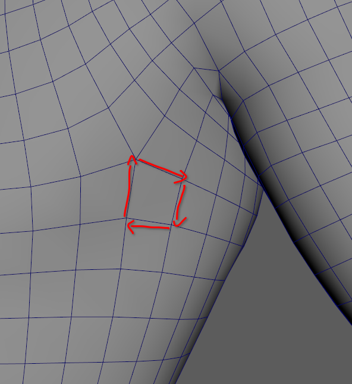
*Edge vectors for a face, keep in mind their origins are at (0, 0, 0).*

#### At a high-level
1. We query for each face how it is deformed from the source rest to the source pose.
2. We apply those transformations to the target rest faces.
3. We ask the computer to give us the points positions that best fit the transformations we gave it for each face.

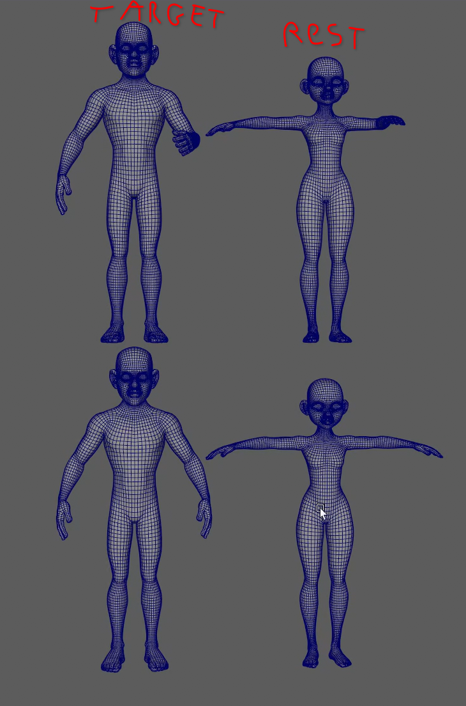
*Our goal is to get the target pose shape from the source pose.*

#### At a mid-level
For this, we need two pieces of data per face:
- A deformation matrix representing the rotation, scaling, and shearing of the face from source rest to source pose.
- A rotation matrix that gets us from the space of the source rest face to the space of the target rest face.

We can then compute our final matrix that will get us from target rest to target pose rest edges.
```python
final_mtx = rotation_mtx @ deformation_mtx @ rotation_mtx.inverse()
```
*i'm figuring out how to render LaTex, for now i just wrote it as Python.*

#### At a low-level
The data is basically three sets of edge vectors for each face: for the source rest mesh, the source pose mesh, and the target rest mesh.

From this data, for each face, we can then use a least-squares minimisation to find the 3x3 matrix that transforms the source rest vectors in the source pose vectors.

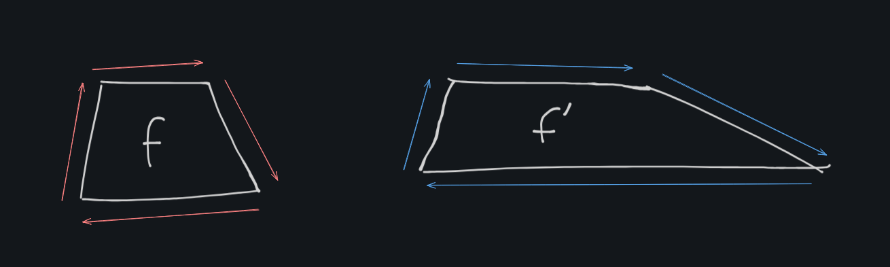
*The deformation matrix for this face would show scaling on one axis of the edge vectors*

We then apply this matrix to the target rest vectors for the face, and query this data. 
Once we have it, we can use a larger least-squares minimisation, this time to figure out the points position for the target pose mesh.

If you've been following my explanations you might wonder, why do we need least-squares here?
We already have the matrix that transforms each face into the desired target pose face... 

Yes we do, but this would give us 4 points for each quad face, since faces are connected we basically are left with duplicate positions.
That's where least-squares comes in, it allows us to basically compromise and find the best positions that fit all of our requirements with the least error squared (hence least-squares minimisation).

> Least-squares minimisation basically gives you the best approximation given a set of constraints you set. 
You can think of it as having a graph with plotted points, least-squares would give you the curve that best fits the points, the one with the least amount of deviation.


## Bandage Tool
As its name indicate this one is used to cleanup tricky areas of the mesh.
It works with a **Laplacian matrix**, which is a sort of "roughness detector". 
For each vertex it calculates the difference between the vertex position and the average of its neighbours positions.
From this matrix we can decide where our vertices should be to be as smooth as possible.

The paper uses a bi-Laplacian matrix which gives less volume loss in the results.
I tested with Laplacian, bi-Laplacian, and tri-Laplacian matrices and here are the results.

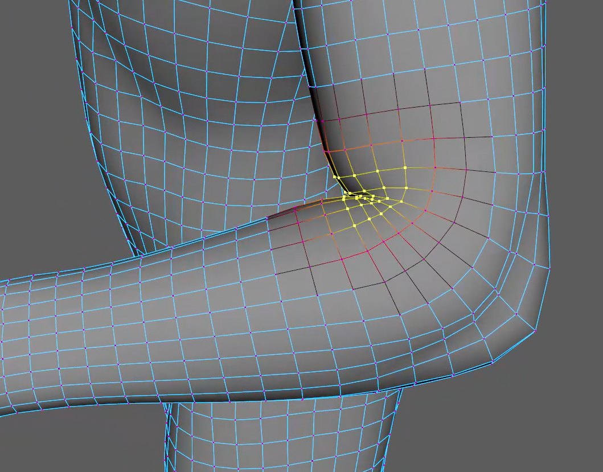
*This is the area we want to cleanup.*
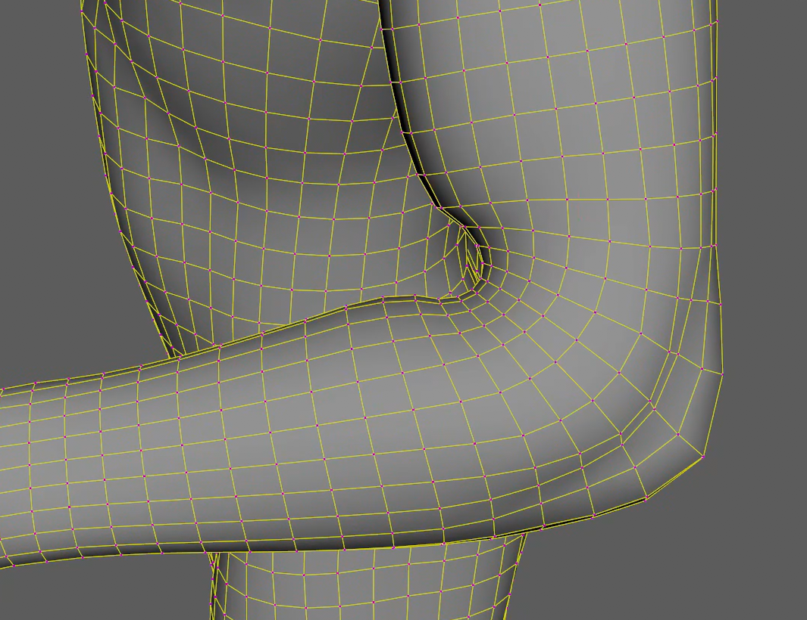
*simple Laplacian, we can see huge volume loss but really smooth.*
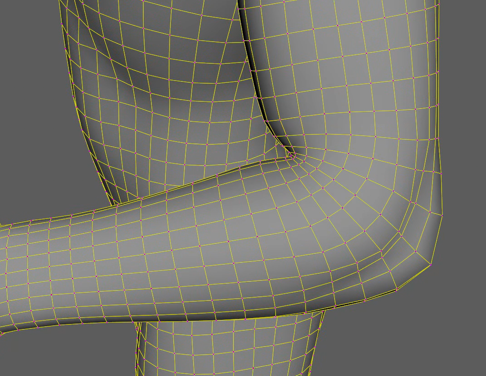
*bi-Laplacian, less volume loss, the elbow is cleaned-up and smoothened a bit.*
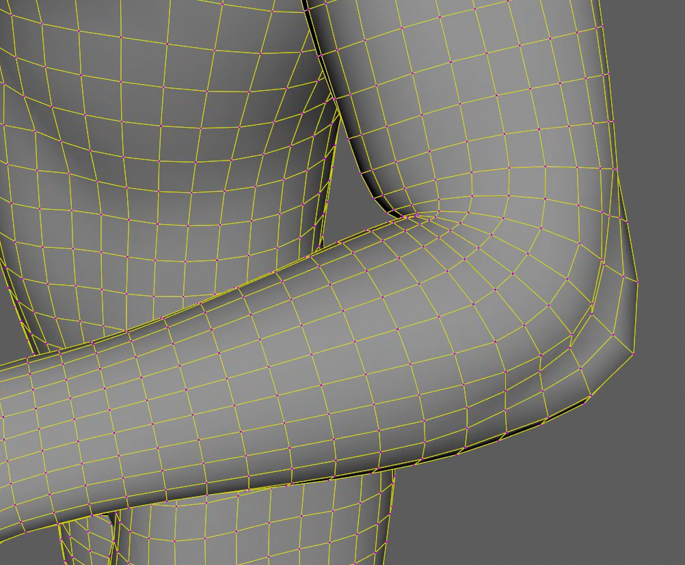
*tri-Laplacian, least volume loss, not enough in some areas.*


## Rest-Aware Relaxation
This last one was the hardest for me to implement, I kept running into issues with my final displacement being wrong when using the alpha slider.
It also felt like a never ending quest because of the number of different parameters that the relax can use.

Nonetheless, I got it working, and I'm very proud of the results!

Here is a simplified demo showing what "rest-aware" means:
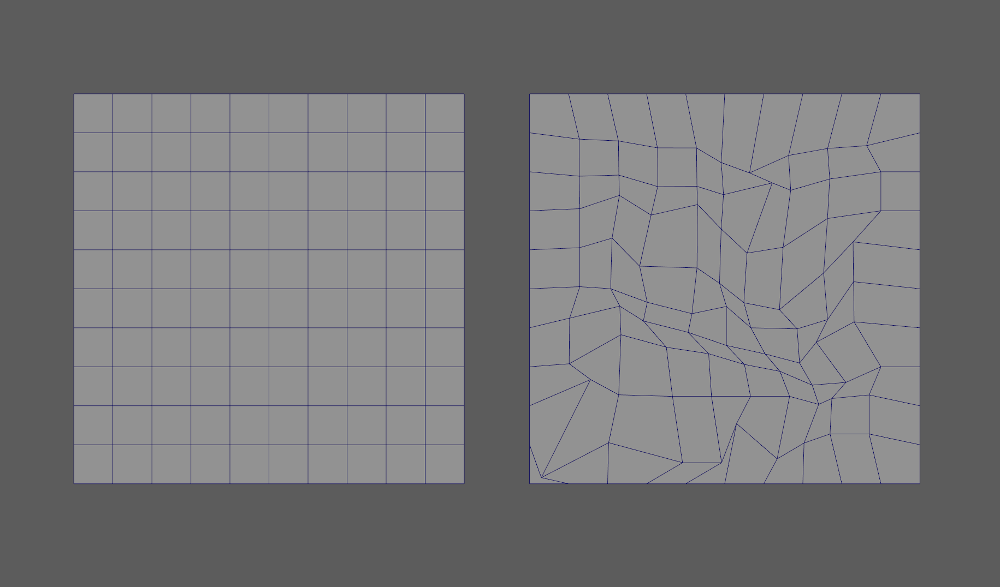
*On the left, a perfect grid. On the right, the grid we want to smooth.*

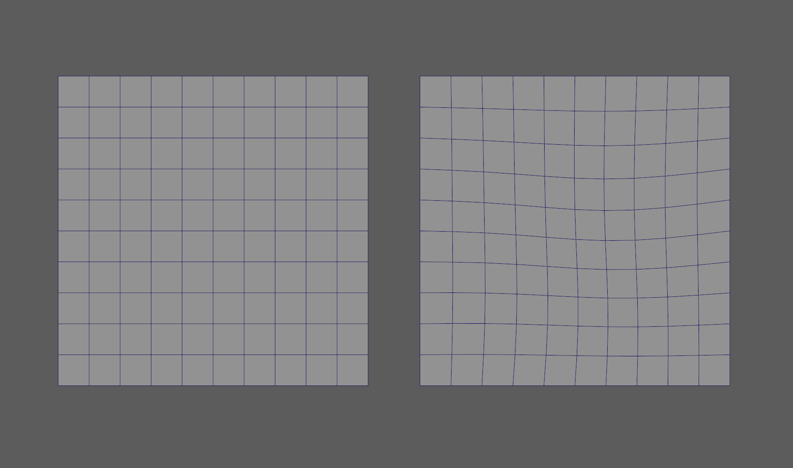
*Here are the results. With 24 iterations, we start to see the grid pattern emerging again.*

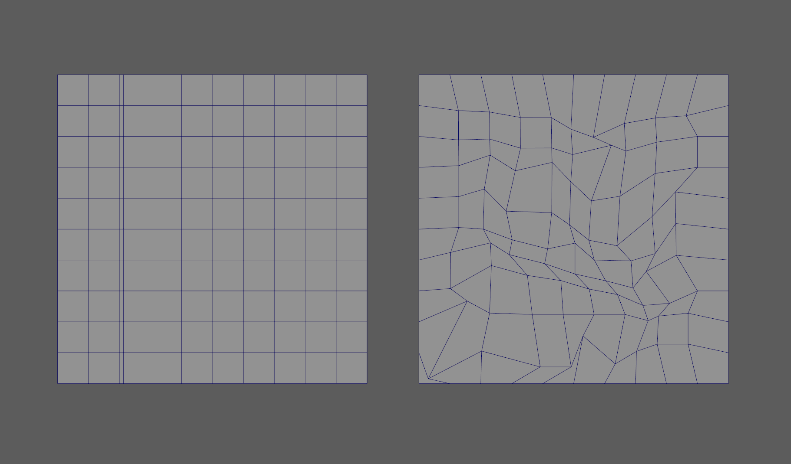
*On the left, we now moved one edge very close to another, disrupting the grid. On the right, the grid we want to smooth.*

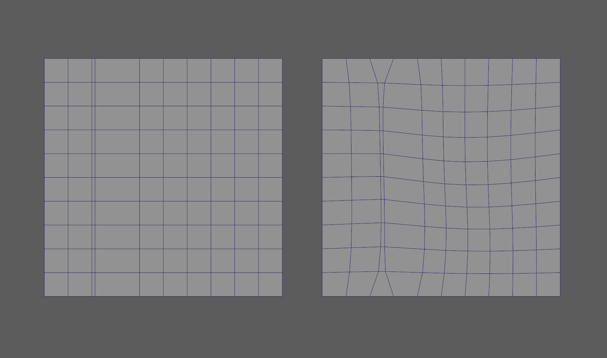
*You can now se what rest-aware means, it takes the edge flow of the rest mesh and takes it into account in the result.*


## Conclusion
When I started this project, I wanted to prove to myself that I could understand harder math than I'm used to and implement more abstract concepts.

I'm usually quite technical, even for a rigging artist, but my day to day mostly consists of dealing with 4x4 matrices and vectors.
This project made me want to keep on learning more and more advanced math and overall scientific concepts.

I used to think that tools like the Sculpt Transfer weren't possible without machine learning but, in a shocking turn of events, I was dead wrong.

That's good news for me, I prefer my tools to be deterministic rather than probabilistic, probably has to do with unattended trust issues... :)


## Acknowledgements
I'd like to thank the entire team who put out this paper for their contribution to this field, seeing that doing those type of things is not only possible but achievable fills me with joy and motivation.

I'd also like to personally thank Fernando de Goes for helping me figure out the last details that were bugging me on the Rest-Aware relaxation.
